<!-- aicom-mirror-notice -->
> **📖 Read-only mirror.** `aimarket-school` is published from the canonical AI-Factory monorepo.
> **Pull requests are not accepted** — any commit pushed here is overwritten by
> `scripts/mirror_satellites.sh` on the next sync.
> 🐞 Found a bug or have a request? Please **[open an issue](https://github.com/alexar76/aimarket-school/issues)**.

# AIMarket School

<!-- aicom-readme-badges -->
<p align="center">
  <a href="https://github.com/alexar76/aimarket-school/actions/workflows/ci.yml"></a>
  
  
  
  <a href="https://edu.modelmarket.dev/"></a>
  
  <a href="https://github.com/alexar76/aimarket-school/blob/main/LICENSE"></a>
</p>
<!-- /aicom-readme-badges -->

> 🌐 **English** · [Русский](docs/README.ru.md) · [Español](docs/README.es.md) · [Français](docs/README.fr.md) · [中文](docs/README.zh.md) · [Glossary](https://github.com/alexar76/aicom/blob/main/docs/localization-glossary.md)


<p align="center">
  <a href="https://edu.modelmarket.dev/">
    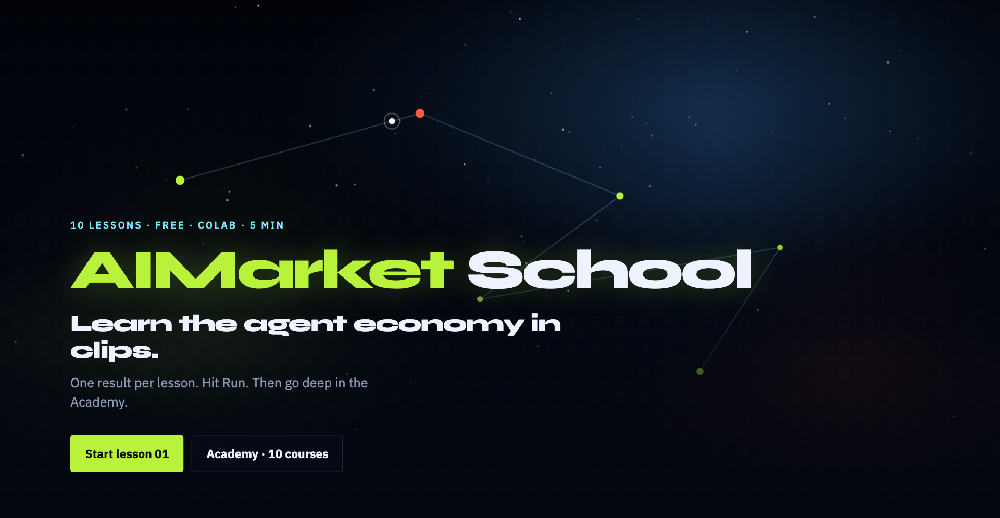
  </a>
  <br>
  <sub>Cosmic portal · Try-it + Colab · <a href="https://edu.modelmarket.dev/"><b>open edu.modelmarket.dev →</b></a></sub>
</p>

<p align="center">
  <a href="https://edu.modelmarket.dev/agents-in-5-min/">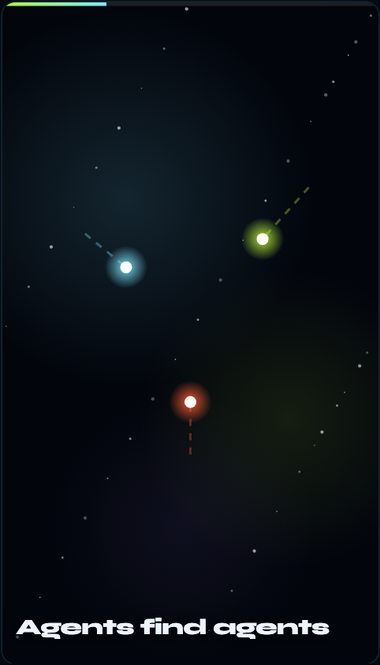</a>
  <a href="https://edu.modelmarket.dev/unfakeable-random/">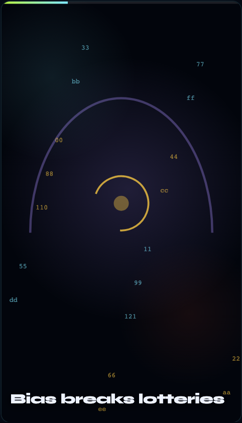</a>
  <a href="https://edu.modelmarket.dev/poison-check/">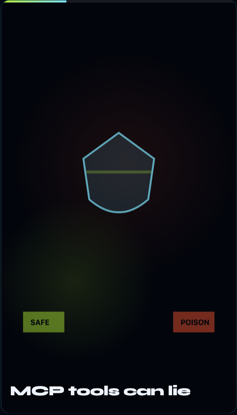</a>
  <a href="https://edu.modelmarket.dev/ai-pays-ai/">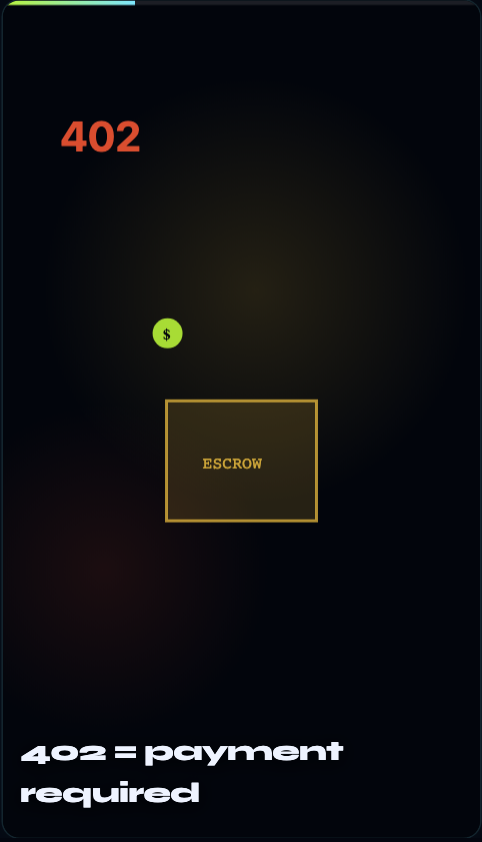</a>
  <a href="https://edu.modelmarket.dev/trust-without-magic/">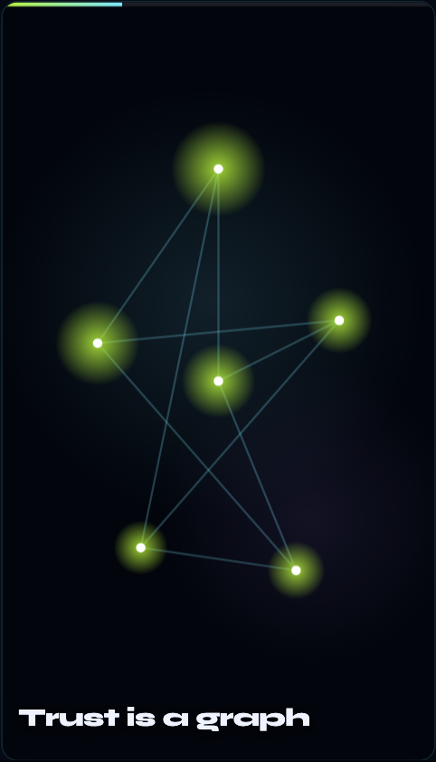</a>
  <a href="https://edu.modelmarket.dev/proof-not-vibes/">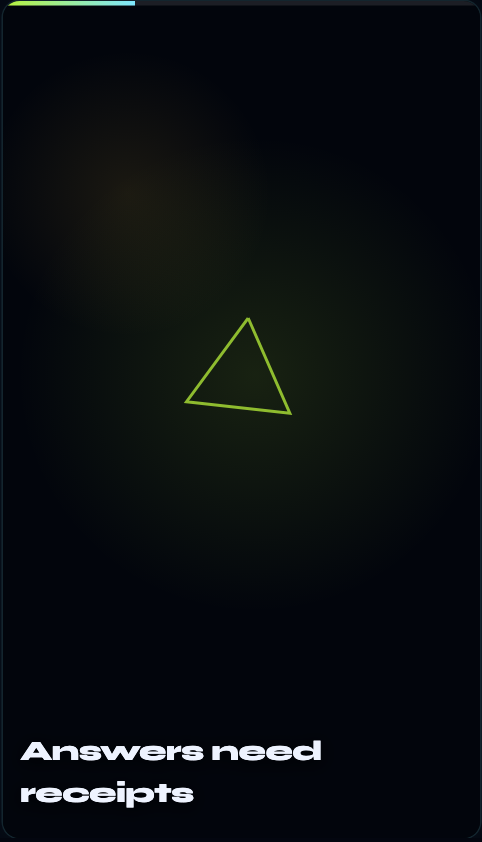</a>
  <a href="https://edu.modelmarket.dev/agent-lottery/">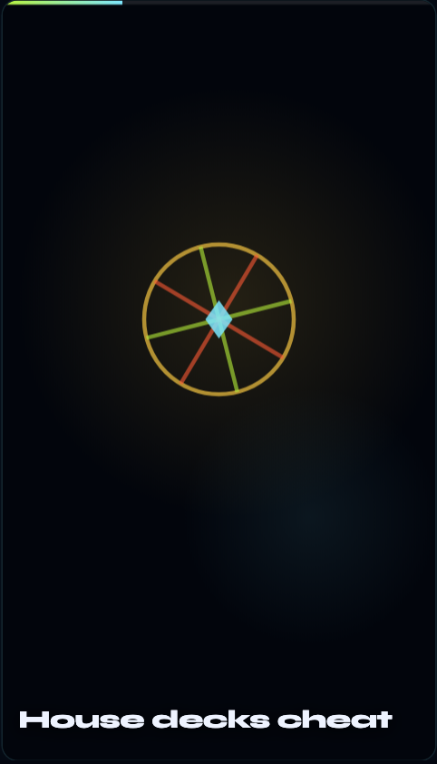</a>
  <a href="https://edu.modelmarket.dev/factory-one-shot/">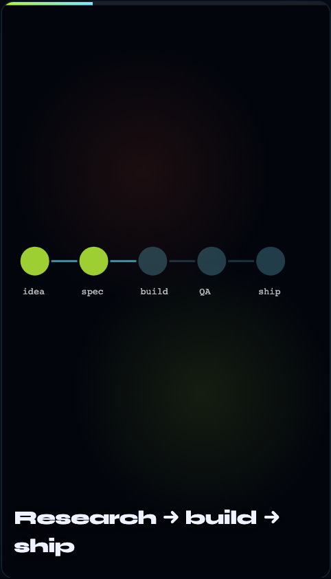</a>
  <a href="https://edu.modelmarket.dev/mesh-in-3d/">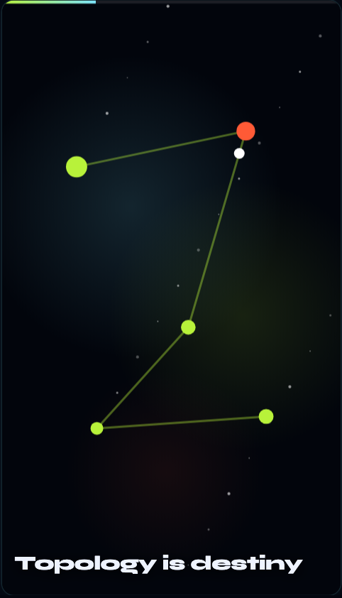</a>
  <a href="https://edu.modelmarket.dev/physics-beats-blackbox/">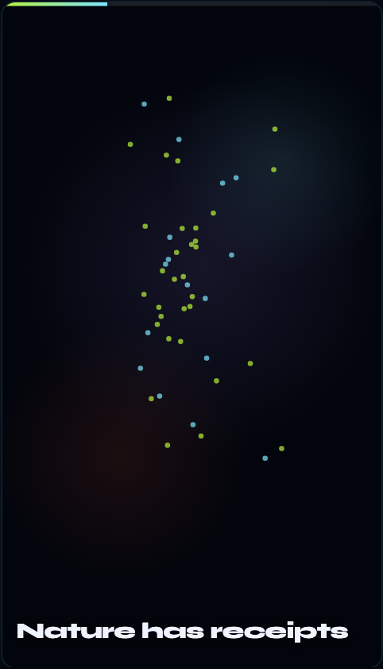</a>
  <br>
  <sub>Per-lesson reel scenes · click any clip · <a href="#gallery">full gallery ↓</a></sub>
</p>

> **Live:** **[edu.modelmarket.dev](https://edu.modelmarket.dev/)** · **Mirror:** [modeldev…/school/](https://modeldev.modelmarket.dev/school/) · **Academies:** [aimarket-courses](https://alexar76.github.io/aimarket-courses/) · **Locales:** `/ru/` · `/es/` · `/fr/` · `/zh/`

Clip-length lessons that on-ramp into the [10 academies](https://alexar76.github.io/aimarket-courses/). One result per lesson — hit **Run** in the browser or open **Colab**, then go deep.

## Lessons

| # | Clip | Live | Academy |
|---|------|------|---------|
| 01 | **[3 Agents. Zero Dashboard.](https://edu.modelmarket.dev/agents-in-5-min/)** | [Try-it](https://edu.modelmarket.dev/agents-in-5-min/) · [Colab](https://colab.research.google.com/github/alexar76/aimarket-school/blob/main/notebooks/agents-in-5-min.ipynb) | Orchestration |
| 02 | **[Random You Can't Rig](https://edu.modelmarket.dev/unfakeable-random/)** | [Try-it](https://edu.modelmarket.dev/unfakeable-random/) · [Colab](https://colab.research.google.com/github/alexar76/aimarket-school/blob/main/notebooks/unfakeable-random.ipynb) | Verifiable Randomness |
| 03 | **[Catch Tool Poisoning](https://edu.modelmarket.dev/poison-check/)** | [Try-it](https://edu.modelmarket.dev/poison-check/) · [Colab](https://colab.research.google.com/github/alexar76/aimarket-school/blob/main/notebooks/poison-check.ipynb) | MCP Security |
| 04 | **[AI Pays AI — $0.01](https://edu.modelmarket.dev/ai-pays-ai/)** | [Try-it](https://edu.modelmarket.dev/ai-pays-ai/) · [Colab](https://colab.research.google.com/github/alexar76/aimarket-school/blob/main/notebooks/ai-pays-ai.ipynb) | Agent Economy |
| 05 | **[Trust Without Magic](https://edu.modelmarket.dev/trust-without-magic/)** | [Try-it](https://edu.modelmarket.dev/trust-without-magic/) · [Colab](https://colab.research.google.com/github/alexar76/aimarket-school/blob/main/notebooks/trust-without-magic.ipynb) | Mathematics of Trust |
| 06 | **[Optimization With Receipts](https://edu.modelmarket.dev/proof-not-vibes/)** | [Try-it](https://edu.modelmarket.dev/proof-not-vibes/) · [Colab](https://colab.research.google.com/github/alexar76/aimarket-school/blob/main/notebooks/proof-not-vibes.ipynb) | Optimization with Proofs |
| 07 | **[Agent Lottery on Base](https://edu.modelmarket.dev/agent-lottery/)** | [Try-it](https://edu.modelmarket.dev/agent-lottery/) · [Colab](https://colab.research.google.com/github/alexar76/aimarket-school/blob/main/notebooks/agent-lottery.ipynb) | Smart Contracts |
| 08 | **[Idea → Product. One Pipeline.](https://edu.modelmarket.dev/factory-one-shot/)** | [Try-it](https://edu.modelmarket.dev/factory-one-shot/) · [Colab](https://colab.research.google.com/github/alexar76/aimarket-school/blob/main/notebooks/factory-one-shot.ipynb) | AI Factory |
| 09 | **[See the Mesh in 3D](https://edu.modelmarket.dev/mesh-in-3d/)** | [Try-it](https://edu.modelmarket.dev/mesh-in-3d/) · [Colab](https://colab.research.google.com/github/alexar76/aimarket-school/blob/main/notebooks/mesh-in-3d.ipynb) | 3D Data Viz |
| 10 | **[Physics Beats the Black Box](https://edu.modelmarket.dev/physics-beats-blackbox/)** | [Try-it](https://edu.modelmarket.dev/physics-beats-blackbox/) · [Colab](https://colab.research.google.com/github/alexar76/aimarket-school/blob/main/notebooks/physics-beats-blackbox.ipynb) | Physics-Inspired Computing |

Notebooks live on [`alexar76/aimarket-school/notebooks`](https://github.com/alexar76/aimarket-school/tree/main/notebooks).

---

## Gallery {#gallery}

Same visuals as **[edu.modelmarket.dev](https://edu.modelmarket.dev/)** — each lesson has its own reel scene (not one shared mesh). Portal hero is above; here are the clip stills:

| | | |
|---|---|---|
| <a href="https://edu.modelmarket.dev/agents-in-5-min/"></a><br>**[01 · Agents](https://edu.modelmarket.dev/agents-in-5-min/)** | <a href="https://edu.modelmarket.dev/unfakeable-random/"></a><br>**[02 · Platon VRF](https://edu.modelmarket.dev/unfakeable-random/)** | <a href="https://edu.modelmarket.dev/poison-check/"></a><br>**[03 · WARDEN](https://edu.modelmarket.dev/poison-check/)** |
| <a href="https://edu.modelmarket.dev/ai-pays-ai/"></a><br>**[04 · HTTP 402](https://edu.modelmarket.dev/ai-pays-ai/)** | <a href="https://edu.modelmarket.dev/trust-without-magic/"></a><br>**[05 · Trust graph](https://edu.modelmarket.dev/trust-without-magic/)** | <a href="https://edu.modelmarket.dev/proof-not-vibes/"></a><br>**[06 · Proofs](https://edu.modelmarket.dev/proof-not-vibes/)** |
| <a href="https://edu.modelmarket.dev/agent-lottery/"></a><br>**[07 · Lottery](https://edu.modelmarket.dev/agent-lottery/)** | <a href="https://edu.modelmarket.dev/factory-one-shot/"></a><br>**[08 · Factory](https://edu.modelmarket.dev/factory-one-shot/)** | <a href="https://edu.modelmarket.dev/mesh-in-3d/"></a><br>**[09 · Mesh](https://edu.modelmarket.dev/mesh-in-3d/)** |
| <a href="https://edu.modelmarket.dev/physics-beats-blackbox/"></a><br>**[10 · Physics](https://edu.modelmarket.dev/physics-beats-blackbox/)** | | |

> **Regenerate gallery:** [`docs/GALLERY.md`](docs/GALLERY.md) — `python3 school/scripts/capture_readme_gallery.py`

---

## Develop

Copy lives in `lessons.yaml` + `i18n.yaml` (EN/RU/ES/FR/ZH). Builder: `build.py`.

```bash
# Nested under modeldev (/school/)
python3 school/build.py

# Dedicated edu portal (site root)
SEO_BASE_URL=https://edu.modelmarket.dev SCHOOL_MOUNT= SCHOOL_OUT=edu-landing \
  LEARN_BASE=https://modeldev.modelmarket.dev python3 school/build.py

# Deploy edu.modelmarket.dev
./scripts/deploy_edu_school.sh --remote my-vps
```

Both builds emit the same pages; only the portal is indexable. Every page
canonicalizes to `SCHOOL_CANONICAL_BASE` (default `https://edu.modelmarket.dev`),
and `robots.txt` + `sitemap.xml` are written **only** by the build whose base is
that canonical host — so the `/school/` mirror never competes with the portal.
`og:image` / `twitter:image` are served from each site's own `og/` directory
(copied from `docs/screenshots/` + `docs/recordings/`).

| Env | Default | Purpose |
|-----|---------|---------|
| `SEO_BASE_URL` | `https://modeldev.modelmarket.dev` | Absolute URLs of **this** build |
| `SCHOOL_MOUNT` | `school` | URL segment (`""` = site root) |
| `SCHOOL_OUT` | `ecosystem-landing` | Output directory |
| `SCHOOL_CANONICAL_BASE` | `https://edu.modelmarket.dev` | Canonical/hreflang host |
| `SCHOOL_CANONICAL_MOUNT` | `""` | Canonical mount segment |
| `SCHOOL_HUB_PROXY` | `/hub` | Same-origin hub bridge (`""` disables) |
| `SCHOOL_HUB_URL` | `https://modelmarket.dev` | Public hub fallback |
| `LEARN_BASE` | `https://modeldev.modelmarket.dev` | Academy / guides links |

## Tests

```bash
pip install pytest pyyaml
pytest tests -q            # satellite layout
pytest school/tests -q     # monorepo layout
```

They check what used to rot silently: 10 lessons × 5 languages complete, committed
notebooks identical to a fresh build, the portal↔mirror canonical split,
`og:image` assets, robots/sitemap ownership, and that every demo endpoint still
matches the nginx bridge. CI: [`.github/workflows/ci.yml`](.github/workflows/ci.yml).

## Try-it in the browser

The hub keeps a **fail-closed** CORS allowlist, so a page cannot call
`modelmarket.dev` cross-origin. Each portal therefore proxies four allow-listed
demo endpoints from its own origin — three read-only `GET`s plus the unpaid
`POST /ai-market/v2/invoke` that lesson 04 is about (tighter budget; channel and
admin paths stay unreachable) —
[`deploy/nginx/snippets/school-hub-bridge.conf`](https://github.com/alexar76/aicom/blob/main/deploy/nginx/snippets/school-hub-bridge.conf),
included by the `edu` and `modeldev` vhosts. The client tries `/hub/…` first and
falls back to the public URL, so lessons degrade to an honest "blocked by the
browser → open Colab" message instead of `TypeError: Failed to fetch`.

## Publish (scripts)

```bash
# School satellite → alexar76/aimarket-school (Colab notebooks live ONLY here)
./scripts/mirror_satellites.sh --satellite aimarket-school

# Monorepo → Gitea
./scripts/push_gitea_monorepo.sh

# Live edu portal (+ /hub bridge — required for Try-it demos)
./scripts/deploy_edu_school.sh --remote my-vps
```

Colab URLs always point at `alexar76/aimarket-school` (`school/` is excluded from the factory `aicom` mirror — do not use an `aicom` Colab path).

**GitHub:** [alexar76/aimarket-school](https://github.com/alexar76/aimarket-school) · **Monorepo path:** `school/`
